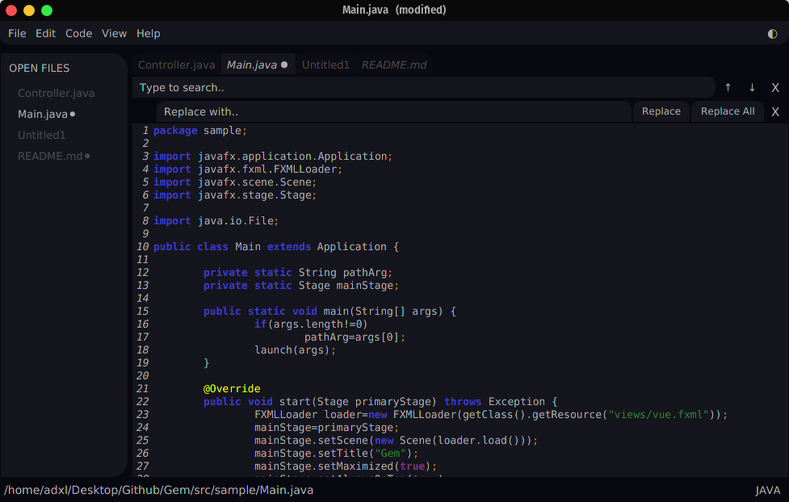

# Gem Code Editor
<p align="center">
    
</p>
Gem is a modern code editor with a simple yet customizable design.  
  
## Version 2.0
This is the latest version of Gem.

## Download & Install
1. Download Gem_v2.0 [here](https://github.com/adxl/Gem/releases/tag/2.0)
2. Extract the .zip file
3. Run install.sh :
    ```
    $ ./install.sh
    ```
4. Look for Gem in your applications or start it using:
    ```
    $ gemc 
    ```
   OR
    ```
    $ gemc "/path/to/file" 
    ```
5. Enjoy :)

## Contributing
Information about contributing [here](https://github.com/adxl/Gem)


